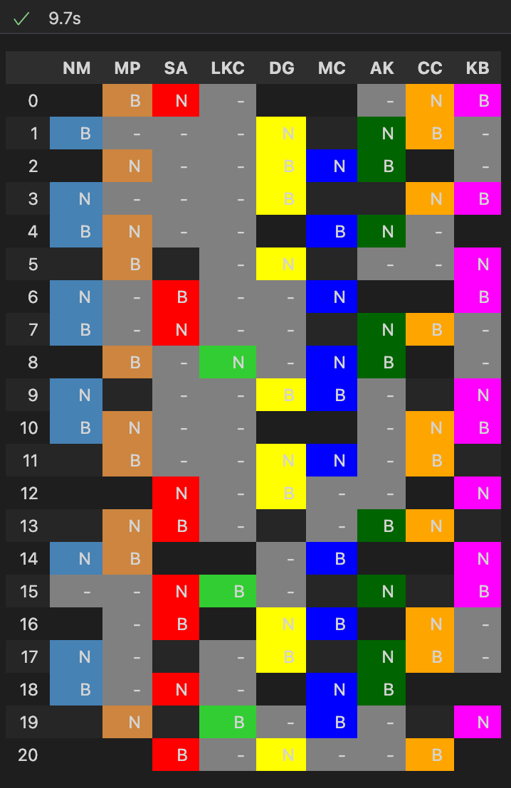
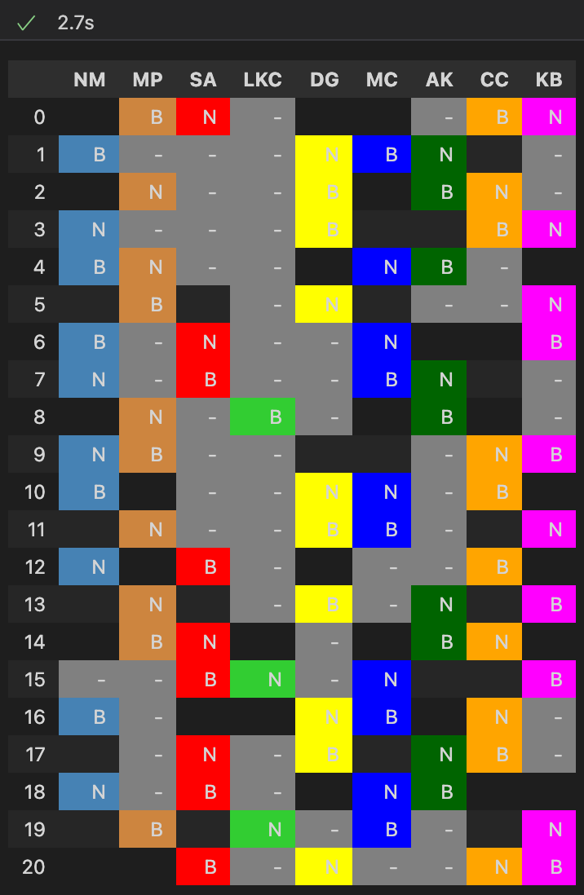

## vet-scheduler
# v1: Gurobi specific implementation
~2x than v2 faster but only supports GUROBI solver

# v2: General implementation with CVXPY
CBC performs the best of free solvers but 5-10x slower than v1 or 3-5x slower than v2 CBC

CBC:

GUROBI:

